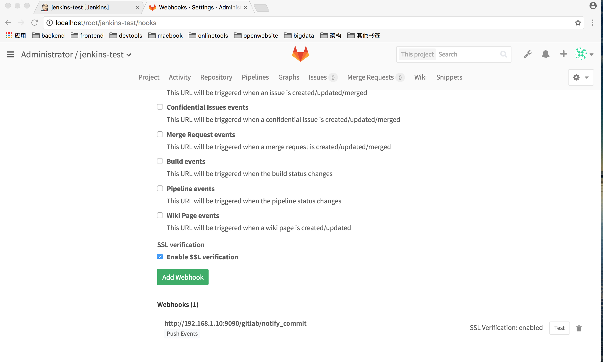
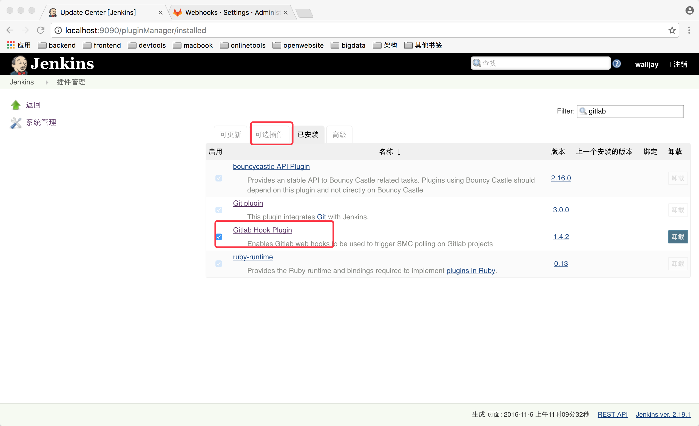
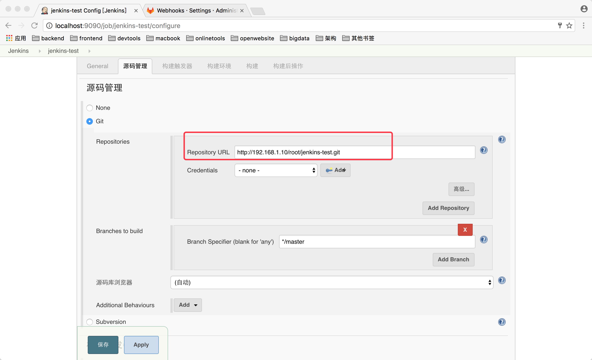
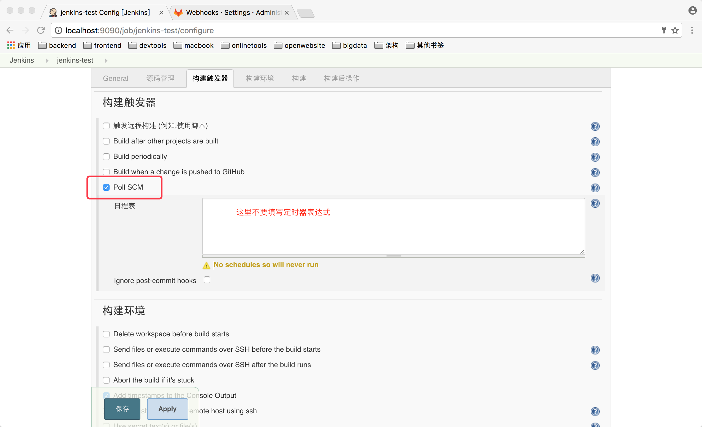
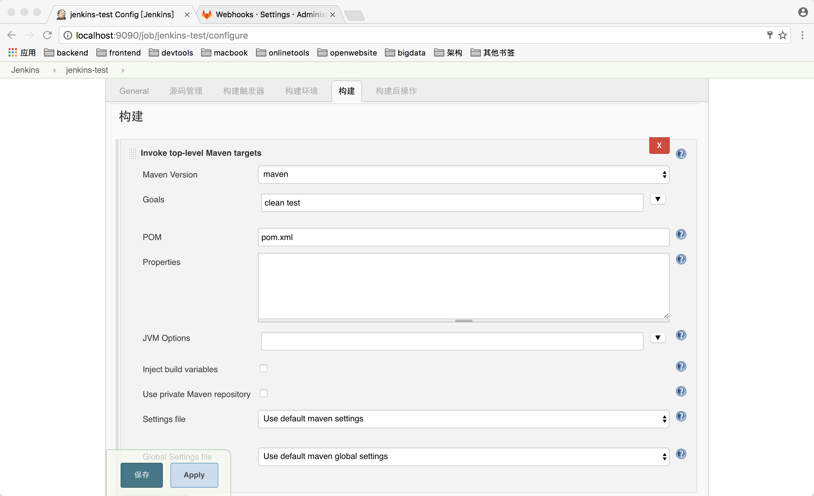

### 安装gitlab
注明：本地的IP地址为192.168.1.10

使用docker安装gitlab
	
	docker pull gitlab/gitlab-ce
	
利用kitematic工具修改端口映射。
由于是docker镜像制作的gitlab服务，所以创建的项目的地址形如`git@b5563cc2ca26:root/jenkins-test.git`,这样的地址导致git clone下载不下来，所以必须修改生成的地址为`git@192.168.1.10:root/jenkins-test.git`,
进入到容器中修改文件`/etc/gitlab/gitlab.rb`
	
	nano /etc/gitlab/gitlab.rb
	
修改`external_url 'http://192.168.1.10'`

浏览器打开<http://localhost>，初始访问提示修改密码为8为有效字符串,用户名默认为`root`，使用方法类似github，添加sshkey。

登录进去之后创建一个项目库，添加webhooks`http://192.168.1.10:9090/gitlab/notify_commit`，
`http://192.168.1.10:9090`为jenkins的访问地址

### 安装jenkins
	
	docker pull jenkins

启动jenkins容器，修改端口映射为`9090`，浏览器打开<http://localhost:9090>,根据提示安装推荐的插件，用户名密码在控制台有提示。

1.安装gitlab-hook-plugin插件
	点击系统管理-管理插件
	
因为我已经安装，所在在已安装列表里面。安装完成重启Jenkins服务。
2.新建一个构建作业，主要配置如图

因为是maven项目，所以构建这里的配置如图

这样子只要客户端git push 之后gitlab就会触发hook来自动调用jenkins构建作业。

